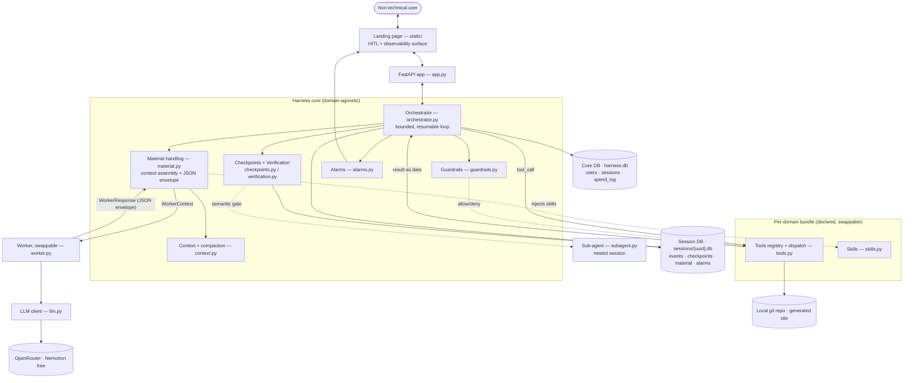
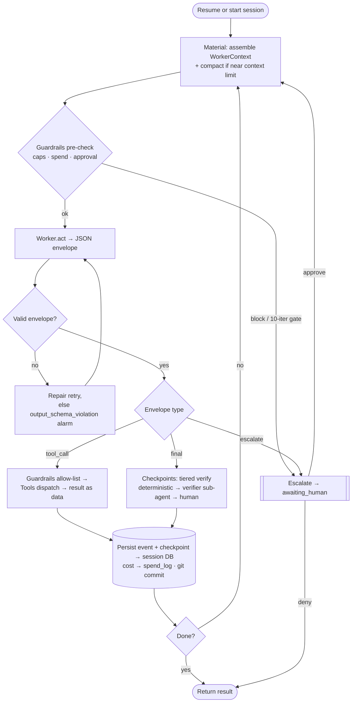

# Design — Components & Interfaces

High-level component map and request flow. For the narrative see `overview.md`; for full implementation detail see `implementation-architecture.md`. Diagrams are Mermaid (render in GitHub/VS Code).

> **v1 MVP omits the verifier sub-agent and `subagent.py`; checkpoints are deterministic only. The diagrams below show the full architecture — the v1-shipped subset is documented in `docs/v1-spec.md`.**

## Component architecture

## Key interfaces
- **User ↔ Landing page ↔ FastAPI** — HTTP/JSON: submit an idea, view status/cost, answer escalations (approve/deny).
- **FastAPI ↔ Orchestrator** — create or resume a run by `session_id`.
- **Orchestrator ↔ Worker** — the *only* agent contract: `Worker.act(WorkerContext) -> WorkerResponse`, a serializable, data-only boundary (see *Swappable worker boundary* in `implementation-architecture.md`).
- **Worker ↔ LLM ↔ OpenRouter** — provider details isolated in `llm.py`; returns tokens/cost/latency.
- **Orchestrator ↔ Tools** — orchestrator hands a validated `tool_call`; guardrails allow-list it; dispatch executes; result returns as data.
- **Orchestrator ↔ Guardrails / Checkpoints / Alarms** — pre/post interception, tiered verification, structured alarms.
- **Orchestrator ↔ Store** — append events + checkpoints to the session DB; users/sessions/spend_log in the core DB; cost mirrored for the daily cap.
- **Orchestrator ↔ Sub-agent** — spawn a nested session (own DB, fresh context); only the result returns to the parent.
- **HITL** — `escalate` → `awaiting_human` → landing page → approve/deny → resume from the last checkpoint.

## The turn loop

**In one line:** guardrails wrap the loop, material handling assembles context and validates the worker's JSON, the worker only *proposes* actions, tools execute under allow-list, checkpoints verify, alarms watch, and every step is persisted to the session DB — resumable from any checkpoint.
