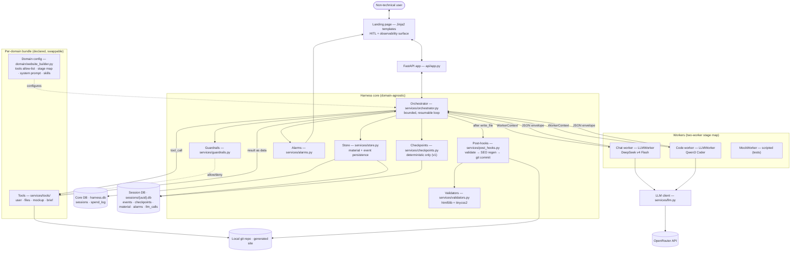
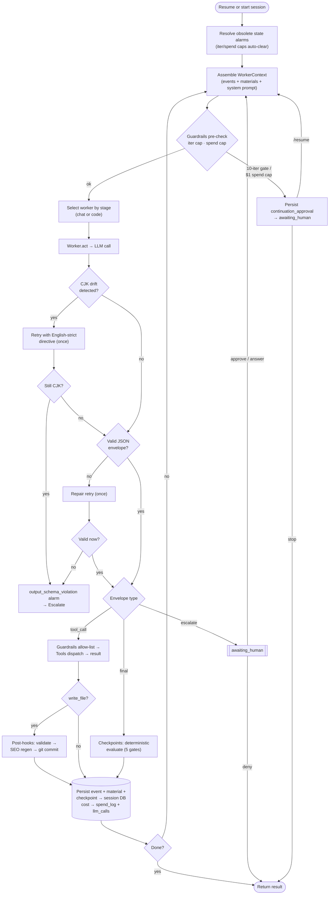

# Design — Components & Interfaces

High-level component map and request flow. For the narrative see `overview.md`; for full implementation detail see `implementation-architecture.md`. Diagrams are Mermaid (render in GitHub/VS Code).

> **v1 checkpoints are deterministic only (no verifier sub-agent). Diagrams below reflect the shipped v1 architecture as documented in `docs/v1-spec.md`.**

## Component architecture

## Key interfaces
- **User ↔ Jinja2 templates ↔ FastAPI** — HTTP/HTML: chat-first UI with conversation bubbles, context-sensitive input area, details accordion, cost/alarm display.
- **FastAPI ↔ Orchestrator** — create or resume a run by `session_id`; `/resume` auto-unsticks `awaiting_human` via `force_continue`.
- **Orchestrator ↔ Worker** — the *only* agent contract: `Worker.act(WorkerContext) -> ToolCall | Final | Escalate`, a serializable, data-only boundary. Two stage-mapped `LLMWorker` instances (chat + code) wired by the domain bundle; `MockWorker` for tests.
- **Worker ↔ LLM ↔ OpenRouter** — provider details isolated in `services/llm.py`; returns tokens/cost/latency. 429 → auto-swap to fallback model.
- **Orchestrator ↔ Tools** — orchestrator hands a validated `tool_call`; guardrails allow-list it (7 tools); dispatch executes; result returns as data.
- **Orchestrator ↔ Post-hooks** — after every successful `write_file`: validate (html5lib/tinycss2) → regenerate SEO artifacts → git commit.
- **Orchestrator ↔ Guardrails / Checkpoints / Alarms** — pre/post interception, deterministic verification (5 checkpoints), 4 alarm types with state-based auto-resolve.
- **Orchestrator ↔ Store** — append events + checkpoints + materials to the per-session DB; sessions/spend_log in the core DB; `llm_calls` audit table in the per-session DB.
- **HITL** — `escalate` / iter-cap / spend-cap → `awaiting_human` → chat UI → approve/deny/answer → resume. Rewind to any prior `awaiting_human` event via `POST /sessions/{id}/rewind`.

## The turn loop

**In one line:** guardrails wrap the loop, the orchestrator selects the stage-appropriate worker, validates the JSON envelope (with CJK-drift and repair retries), tools execute under allow-list with post-hooks on writes, deterministic checkpoints verify, alarms watch, and every step is persisted — resumable from any event.
